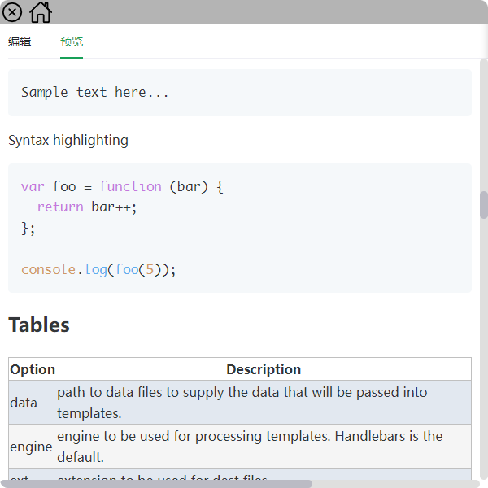

# 小应用

## 机缘

一直跃跃欲试的做点东西，所以试一下，看看能做一些什么有趣的东西。

## 自己动手
克隆本项目后，确认网络能安装electron，然后在项目根目录使用命令行`npm install`安装依赖，注意项目命令默认为构建vue页面内容

开发预览：`npm start`

构建非安装包：`npm run pack`

构建安装包：`npm run dist`

## 应用截图

## 简单说明
目前的想法有限，只实现了三个小功能，暂时还没有什么好的点子。
